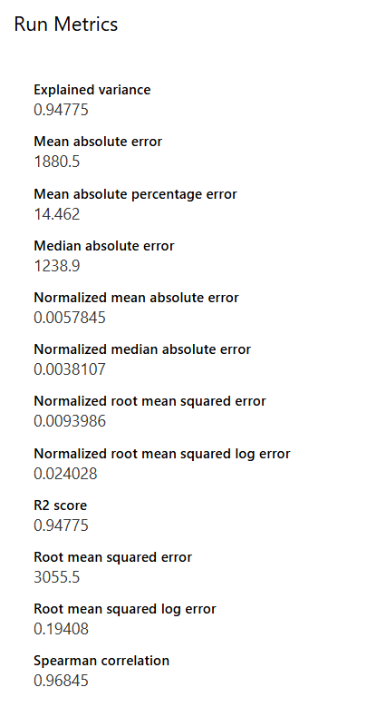
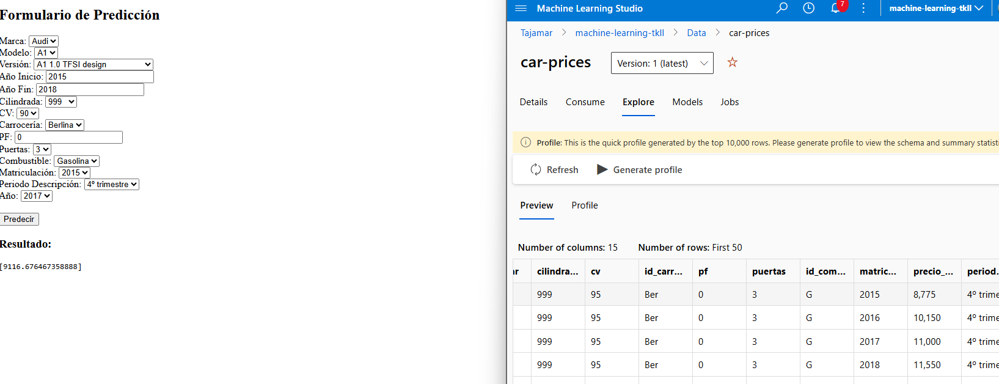
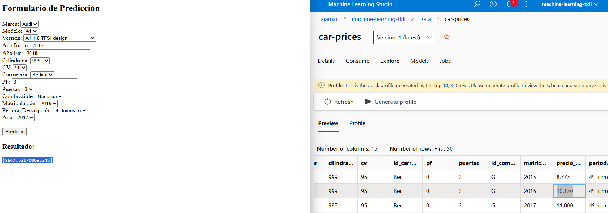
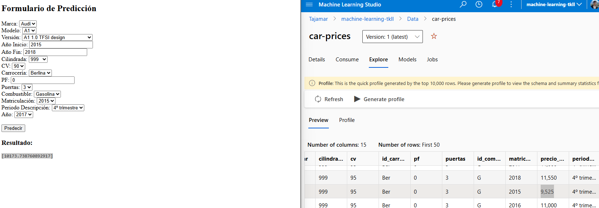
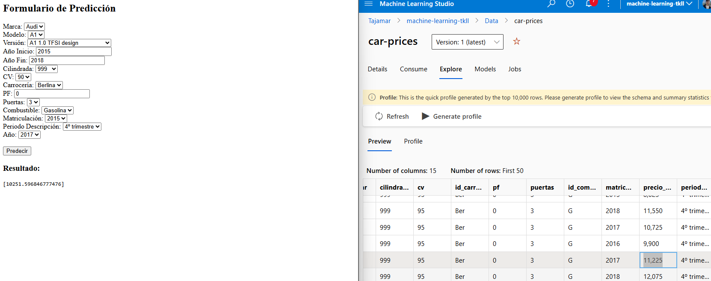

## Cars price prediction   

Este es un projecto para la predición de coches. Se ha utilizado un conjunto de datos de coches para entrenar el modelo en [**Azure Machine Learning Studio**](https://azure.microsoft.com/es-es/products/machine-learning).

Pincha en el link para ver la demo:
[LINK DEMO](https://tajamar365-my.sharepoint.com/:v:/p/tsuenkit_lui/ERlOes9Fy0hNs5l2hUuuBtABqcEVuVgPQhEo_hCi8x8k0A?nav=eyJyZWZlcnJhbEluZm8iOnsicmVmZXJyYWxBcHAiOiJPbmVEcml2ZUZvckJ1c2luZXNzIiwicmVmZXJyYWxBcHBQbGF0Zm9ybSI6IldlYiIsInJlZmVycmFsTW9kZSI6InZpZXciLCJyZWZlcnJhbFZpZXciOiJNeUZpbGVzTGlua0NvcHkifX0&e=OcnABt)

